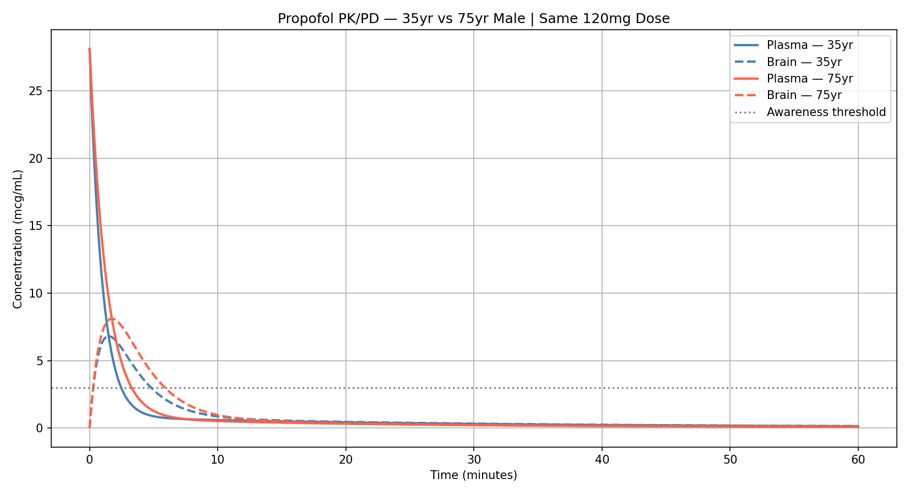

# Propofol PK/PD Simulator

A Python implementation of the Schnider et al. (1999) three-compartment pharmacokinetic/pharmacodynamic model for propofol — the same mathematical framework used in Target Controlled Infusion (TCI) pumps in operating rooms worldwide.

Built by Daniel Torres, Anesthesia Technician at Stanford Medicine and Biophysiology student at San Francisco State University, as part of independent research skill development toward medical school.

## What This Does

Simulates how propofol distributes across three body compartments after an IV bolus:

- **Plasma (Central)** — initial spike then rapid redistribution
- **Muscle (Fast Peripheral)** — absorbs drug quickly, returns it to plasma
- **Fat (Slow Peripheral)** — slow absorption, holds drug for extended periods
- **Effect-Site (Brain)** — estimated brain concentration via ke0 equilibration constant

Patient-specific parameters are calculated using the James lean body mass equation and Schnider clearance formulas, adjusting for age, weight, height, and sex.

## Key Finding

The same 120mg induction dose produces meaningfully different brain concentrations in a 35-year-old vs a 75-year-old patient — directly explaining why anesthesiologists reduce propofol doses in elderly patients.



## How To Run

```bash
pip install numpy matplotlib scipy
python3 simulator.py
```

Change the patient parameters at the top of `simulator.py` to simulate different patients.

## Reference

Schnider TW, et al. *The Influence of Age on Propofol Pharmacodynamics.* Anesthesiology. 1999.
